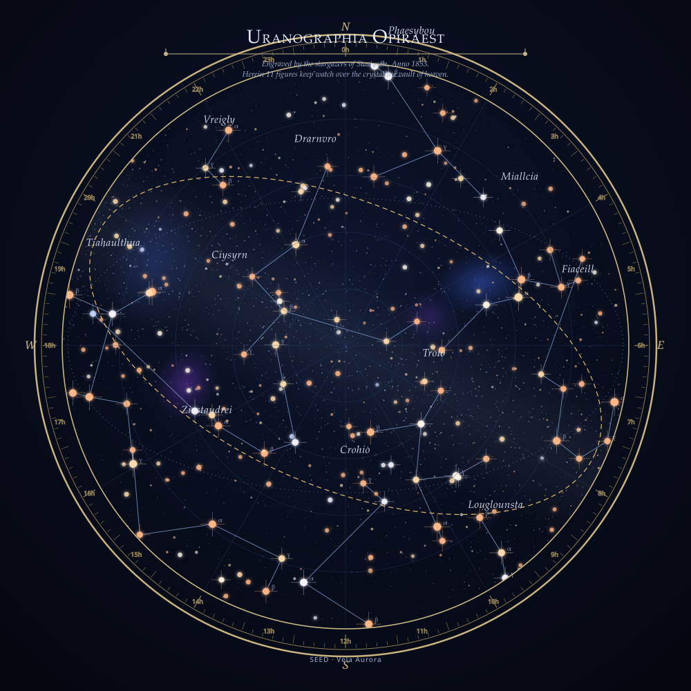

# Constellarium

**Seed a whole fictional night sky — an antique star atlas of constellations that never existed.**

Type any words and Constellarium deterministically renders an entire imaginary
night sky as an engraving-style planisphere: a realistic star field, invented
constellations, Bayer-style star names, a procedural Milky Way and nebulae, and
a decorative frame with RA/Dec graticule, ecliptic ring and a lore cartouche.
The same seed always produces the same sky, and the whole state lives in the URL
hash — so any chart is a shareable permalink.

Single HTML file. Zero dependencies. No build step, no network.



## Why it's cool

Every seed is a museum-style antique atlas of a sky that has never existed —
named figures, star designations, and a scrap of invented mythology — as clean,
print-ready vector art. It sits between generative art and worldbuilding
utility: writers, TTRPG/game designers, and poster makers get instant,
reproducible, shareable celestial maps. Because it's a single deterministic
file, the exact same seed renders the exact same chart on any machine, forever.

## Features

- **Deterministic seeded sky** — `xmur3` hash seeds a `mulberry32` PRNG; the
  seed drives the star field, constellations, names and lore. Same seed → same
  sky, every time.
- **Believable star field** — stars sampled from a magnitude distribution,
  tinted by spectral class (O/B/A/F/G/K/M), sized and glowed by brightness, with
  diffraction spikes on the brightest.
- **Procedural constellations** — bright anchor stars are clustered by
  farthest-point seeding and wired into stick-figures with a degree-limited,
  edge-length-capped minimum spanning tree, so figures read as intentional.
- **Generated names & lore** — syllable-based constellation names, Bayer-style
  designations (Greek letter + Latin-ish genitive), and a short cartouche legend.
- **Deep-sky detail** — noise-driven Milky Way density band, plus scattered
  nebulae, with adjustable intensity.
- **Antique styling** — circular planisphere or rectangular sky, decorative
  border, RA/Dec graticule, celestial-equator and ecliptic rings, degree tick
  ring, compass rose, and title cartouche. Four palettes: Midnight, Antique
  Sepia, Blueprint, Ink Engraving.
- **Live sky** — subtle twinkle and an optional slow planisphere rotation
  (circular projection), with pause.
- **Crisp export** — one-click vector **SVG**, high-res **PNG** (2000px), and
  print poster presets (US-Letter / A3 / A2 / Square at 150dpi with margins,
  border and title). All client-side.
- **Hover inspector** — mouse over any star to read its generated name,
  magnitude, and spectral type.
- **Shareable permalinks** — full state serialized to the URL hash; copy the
  link or use back/forward.

## Run it

Open `index.html` in any modern browser. That's it — no install, no build, no
server.

```
# macOS
open index.html
# Windows
start index.html
# Linux
xdg-open index.html
```

If you prefer serving it (identical result), any static server works, e.g.
`python3 -m http.server` then visit the printed URL.

> Note: PNG and poster export needs a full browser. Opening straight from
> `file://` works in Chrome, Firefox and Edge; some older WebKit builds block
> canvas export, in which case use the SVG export.

## Controls

| Control | What it does |
|---|---|
| **Seed** | Any text. Drives the entire sky. `⟳` randomizes a name. |
| **Surprise me** | New random seed + random palette / projection / parameters. |
| **Copy link** | Copies a permalink carrying the current sky's full state. |
| **Star density** | Number of stars sampled (250–1900). |
| **Constellations** | How many figures to draw (3–20). |
| **Milky Way intensity** | Density of the band wash and its faint stars (0–100%). |
| **Nebulae** | Count of nebula blobs (0–10). |
| **Projection** | Circular planisphere or rectangular sky. |
| **Palette** | Midnight, Antique Sepia, Blueprint, Ink Engraving. |
| **Layers & labels** | Toggle constellation lines, names, star designations, frame, graticule, ecliptic, cartouche, and an "Explain layer" that annotates how the sky was built. |
| **Live sky** | Twinkle and slow rotation (rotation applies to the circular planisphere only). |
| **Export** | SVG (vector), PNG (2×), and poster presets. |
| **Curated skies** | Hand-picked seed presets with live thumbnails. |

All controls (buttons, palette swatches, gallery thumbnails) are keyboard
reachable — Tab to focus, Enter/Space to activate.

## How the generator works

```
seed → xmur3 → mulberry32 PRNG
     → star field (magnitude distribution + spectral classes)
     → farthest-point anchor seeding → clusters → degree-capped MST → figures
     → syllable name generator → Bayer designations + lore cartouche
     → noise-driven Milky Way band + nebulae
     → SVG renderer (gradients, filters, graticule, frame)
```

Each feature draws from its own derived PRNG stream so, for example, changing the
Milky Way slider doesn't reshuffle the constellations.

## URL hash state

State is stored as query params in the hash, e.g.:

```
index.html#seed=Vela+Aurora&p=midnight&proj=circle&d=950&c=11&m=62&n=4&f=1111111011
```

`seed` (seed text), `p` (palette), `proj` (projection), `d`/`c`/`m`/`n`
(density / constellations / milky / nebulae), and `f` (layer toggle bitfield).
Editing the hash or pasting a permalink re-renders that exact sky.

## Gallery

Example exports live in [`gallery/`](gallery/) — real SVGs produced by the same
engine, showcasing the four palettes and both projections.

## License

MIT © 2026 Alex Wictor. See [LICENSE](LICENSE).
